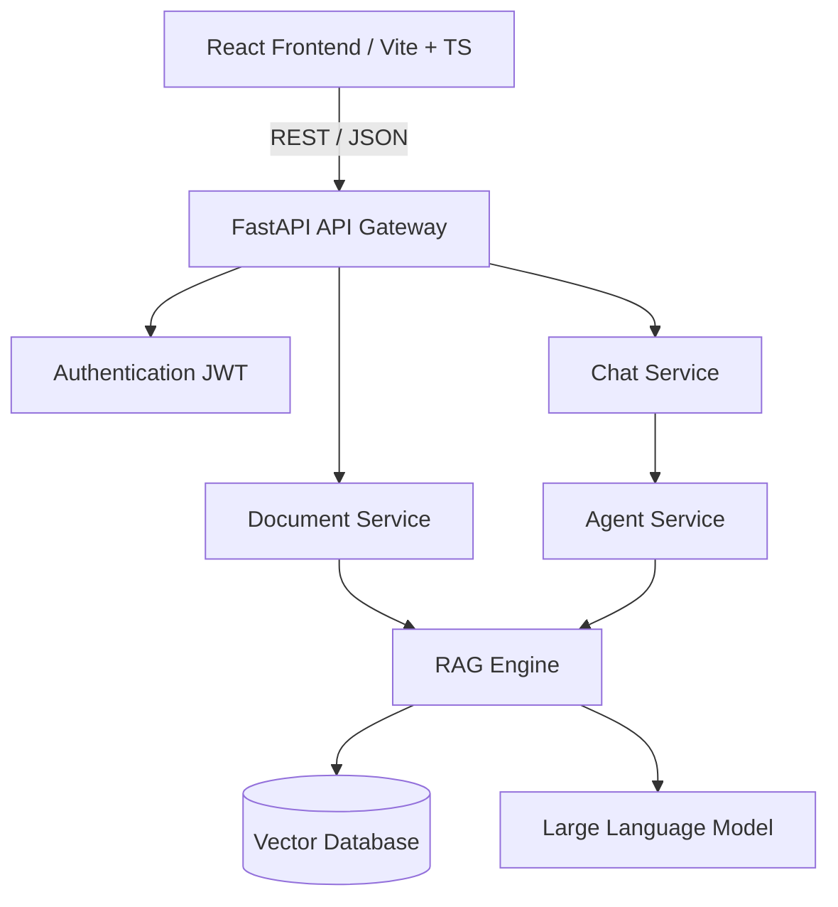

# AegisAI Architecture Documentation

This document describes the architectural layout of **AegisAI – Enterprise Agentic Knowledge Platform**.

## Platform Blueprint

AegisAI is designed around a modular gateway and service pattern to allow future AI and vector operations to scale independently.

## Core Layers

1. **Client (React / Vite / TypeScript / TailwindCSS)**:
   - Modern authenticated single-page application.
   - Provides views for dashboards, knowledge management, chat, and settings.
   
2. **FastAPI API Gateway**:
   - Manages HTTP/WebSocket requests, CORS, and structural JSON errors.
   - Leverages `structlog` for application, request, and security logs.
   
3. **Authentication Layer**:
   - Validates JSON Web Tokens (JWT) using secure `HS256` keys.
   - Resolves active accounts from the database context.
   
4. **Document Service**:
   - Manages files in the raw and processed storage volumes.
   - Enqueues parsing and layout extraction tasks to the Celery worker queue.

5. **Chat Service (Planned Phase 2)**:
   - Manages conversational threads, memory buffers, and user/assistant messages history.

6. **Agent Service (Planned Phase 2)**:
   - Houses agent definitions, tools execution sandbox, and task planners.

7. **RAG Engine (Planned Phase 2)**:
   - Coordinates query expansion, document vector search, context re-ranking, and response synthesis.

8. **Vector Database & Embeddings (Planned Phase 2)**:
   - Exposes vector store endpoints (e.g. PGVector, Qdrant) and maps text chunks to embedding vectors.

9. **LLM Integration (Planned Phase 2)**:
   - Interfaces with LLM APIs (e.g., Gemini API, OpenAI, or local instances) with fallbacks and rate-limiting.
